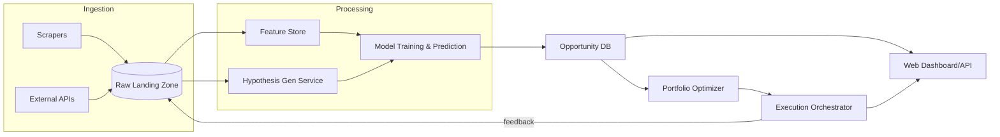

# 1. Purpose

This document defines the **technical specification** for the Autonomous Opportunity Discovery System (AODS).  AODS continuously discovers, evaluates, and prioritizes online attention/pricing inefficiencies across advertising, SEO, retail, and SaaS-replacement markets, delivering a ranked backlog of opportunities and—optionally—triggering automated execution.

---

# 2. Goals & Objectives

| ID   | Objective                                                                                                                 |
| ---- | ------------------------------------------------------------------------------------------------------------------------- |
| G-01 | Identify high-ROI arbitrage opportunities with ≥ 90 % recall of true positives (measured against human-curated benchmark) |
| G-02 | Deliver ranked backlog within 1 h of daily data refresh                                                                   |
| G-03 | Self-improve via closed-loop learning—AUC > 0.85 on success-prediction model within 3 months                              |
| G-04 | Support plug-in data adapters for new sources in ≤ 2 days dev time                                                        |
| G-05 | Maintain end-to-end cost of compute ≤ 4 % of realized monthly profit                                                      |

---

# 3. Scope

* **In scope**: data ingestion, storage, ML/analytics, portfolio optimisation, limited autonomous execution hooks, dashboards, alerting.
* **Out of scope** (v1): multi-lingual content generation, full campaign creative production, legal/brand compliance review.

---

# 4. Stakeholders & Roles

| Role          | Responsibilities                                          |
| ------------- | --------------------------------------------------------- |
| Product Owner | Define opportunity acceptance criteria, review top-N list |
| Data Engineer | Build/maintain ingestion & pipelines                      |
| ML Engineer   | Develop/maintain models, evaluation engine                |
| Growth Ops    | Approve/execute selected opportunities                    |
| DevOps/SRE    | Deploy, monitor, secure infra                             |

---

# 5. High-Level Architecture



---

# 6. Functional Requirements

| FR-ID | Description                                                                                                     |
| ----- | --------------------------------------------------------------------------------------------------------------- |
| FR-1  | Ingest keyword, ad-auction, product-pricing, social-trend, and SaaS-pricing data daily (configurable).          |
| FR-2  | Detect outliers/anomalies across multidimensional metrics (PyOD IsolationForest default).                       |
| FR-3  | Generate hypotheses via rule-based triggers + LLM (GPT-4o) agent.                                               |
| FR-4  | Train & update predictive models (LightGBM/XGBoost) for: conversion-rate, ranking-probability, profit per unit. |
| FR-5  | Compute expected ROI, risk-adjusted return, confidence interval for every hypothesis.                           |
| FR-6  | Optimise opportunity portfolio under budget & resource constraints using MILP (Google OR-Tools).                |
| FR-7  | Expose REST & GraphQL endpoints and a React dashboard for top-N opportunities.                                  |
| FR-8  | Push automated low-risk actions (<$Y spend, >Z% confidence) to ad network APIs via webhook scripts.            |
| FR-9  | Log all data lineage; enable reproducible back-tests with historical snapshots.                                 |
| FR-10 | Retrain models weekly or on ≥ 2 % performance drift (A/B monitored).                                            |

---

# 7. Data Architecture

## 7.1 Raw Landing Zone (Parquet on S3/GCS)

| Source         | Schema Highlights                                                |
| -------------- | ---------------------------------------------------------------- |
| Keyword API    | keyword, locale, `search_volume`, `cpc`, `difficulty`, timestamp |
| Ad Auction     | keyword, network, `avg_cpc`, `ctr`, `conv_rate`, timestamp       |
| Product Prices | sku, site, `price`, `shipping`, stock, timestamp                 |
| Social Trends  | platform, topic, `views`, `engagement_rate`, timestamp           |

## 7.2 Feature Store (DuckDB + Parquet)

* Normalised, deduped tables keyed by `uid` (keyword_id, product_id, etc.).
* Point-in-time correct join logic for back-testing.

---

# 8. ML & Analytics

| Model             | Lib      | Target             | Features                                                       |
| ----------------- | -------- | ------------------ | -------------------------------------------------------------- |
| ConvRatePredictor | LightGBM | conversion_rate   | keyword metrics, intent embeddings, landing-page quality score |
| RankProbability   | XGBoost  | P(rank ≤ 3)        | search metrics, backlink_score, content_score                |
| ProfitRegressor   | CatBoost | profit_per_click | traffic cost, payout, conv prob                                |
| AnomalyDetector   | PyOD     | anomaly_score     | multidimensional metrics per opportunity                       |
| BanditAllocator   | SB3 (TS) | policy             | real-time ROI rewards                                          |

Metrics: AUC > 0.85 for classifiers; SMAPE < 15 % for regressors.

---

# 9. Opportunity Scoring Formulae

```
EV = P_success * (Revenue – Cost) – (1 – P_success) * Cost
RAR = (EV / σ)  # σ = std-dev of profit (Monte Carlo)
Score = RAR * (Payback_weight / Payback_period_months)
```

---

# 10. Portfolio Optimiser

* MILP objective: **max Σ Scoreᵢ · xᵢ** subject to:

  * Σ Costᵢ · xᵢ ≤ Budget
  * Σ DevHoursᵢ · xᵢ ≤ DevCapacity
  * Diversity constraints (channel quotas, locale caps)
* Solver: Google OR-Tools ≥ 9.8; fallback = PuLP-CBC.

---

# 11. Orchestration

* **Apache Airflow** DAGs

  * `daily_ingest` → `feature_refresh` → `hypothesis_gen` → `model_predict` → `portfolio_opt` → `dashboard_push`.
* Task retries w/ exponential backoff.

---

# 12. Deployment

| Layer      | Tech                                                                   |
| ---------- | ---------------------------------------------------------------------- |
| Containers | Docker + Docker-Compose; images published to GHCR                      |
| Cloud      | AWS (EKS) or GCP (GKE) single-region multi-AZ                          |
| CI/CD      | GitHub Actions → Terraform cloud for infra, Argo CD for app deployment |
| Secrets    | HashiCorp Vault, rotated every 90 d                                    |

---

# 13. Monitoring & Logging

* **Prometheus + Grafana**: CPU, memory, task latencies, model inference TPS.
* **ELK Stack**: centralized logs.
* **MLflow**: experiment tracking, model registry, drift alerts.
* PagerDuty on SLO breach (> 1 h pipeline delay).

---

# 14. Security & Compliance

* OAuth 2.0 for dashboard auth (Google Workspace SSO).
* All external requests via vetted proxy pool; obey robots.txt unless explicit permission.
* PII redacted at ingest; GDPR/CCPA compliant.

---

# 15. Cost Management

* Use **Spot instances** for batch model training.
* Data retention policy: raw data 90 d, aggregates 2 y.
* Budget guardrails: CloudWatch alarms when spend > $X/day.

---

# 16. Extensibility

* Data adapters follow **Connector Interface** (`pull()`, `parse()`, `upsert()`).
* New model registered via **ModelPlugin** (predict(), train()).
* LangChain tool wrapper for external LLM agents.

---

# 17. Non-Functional Requirements

| NFR          | Target                                          |
| ------------ | ----------------------------------------------- |
| Availability | 99.5 % pipeline uptime                          |
| Latency      | < 60 min from ingest start to dashboard refresh |
| Scalability  | 5× data volume without arch changes             |
| Security     | SOC2-ready controls                             |

---

# 18. Milestones & Timeline (T0 = project start)

| Phase                    | Duration  | Deliverables                          |
| ------------------------ | --------- | ------------------------------------- |
| P1 – Data Foundations    | T0 + 4 w  | Ingestion pipelines, landing zone     |
| P2 – MVP Models          | T0 + 8 w  | ConvRate & Rank models, basic scoring |
| P3 – Portfolio Optimizer | T0 + 10 w | MILP optimiser, test dashboard        |
| P4 – Closed-Loop Beta    | T0 + 14 w | RL bandit, auto-exec hooks            |
| P5 – Prod Launch         | T0 + 16 w | Full SRE hand-off, SLO monitoring     |

---

# 19. Open Issues / Risks

* Data API quota limits – mitigation: staggered schedules + caching.
* Rapid market shifts – mitigation: weekly retrain, concept-drift alerts.
* Legal constraints on scraping – mitigation: maintain whitelisted domains; comply with ToS.

---

# 20. Approval & Next Steps

* Sign-off by Product Owner & Tech Leads.
* Move to sprint-0: infrastructure bootstrapping.
